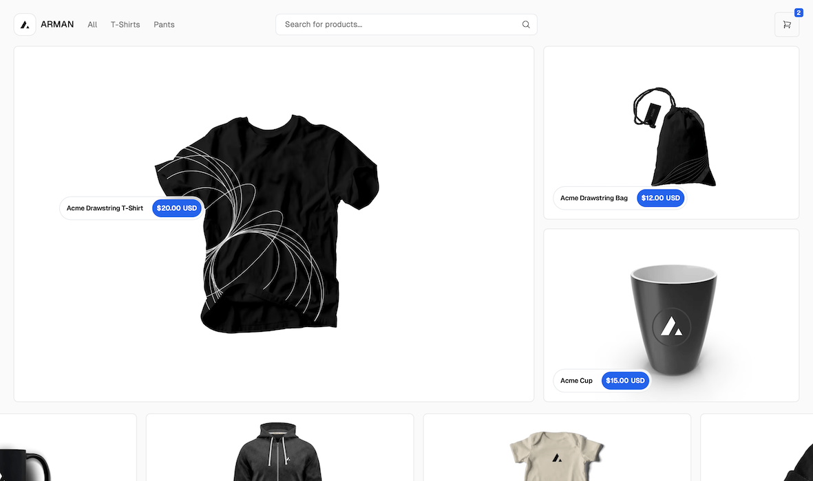

# Fashion Commerce

A modern, high-performance ecommerce application built with Next.js 15 App Router, designed for scalability, speed, and developer experience.

This project showcases advanced features like React Server Components, Server Actions, Suspense, and Edge rendering — ideal for those looking to learn or demonstrate cutting-edge React and Next.js architecture.

## 🚀 Features

- ⚛️ Next.js App Router
- 🌎 Optimized for SEO using Next.js's Metadata
- ⚛️ React Server Components (RSC) and Suspense for seamless rendering
- 🧠 Server Actions for type-safe mutations and simplified server logic
- 🌍 Edge Runtime for faster, globally-distributed performance
- 🗂️ Advanced fetching & caching strategies using App Router patterns
- 🧾 Dynamic Open Graph (OG) images for social media sharing
- 🎨 Tailwind CSS for responsive, utility-first styling
- 🌗 Automatic light/dark mode based on system preferences
- ✅ Comprehensive test suite with Vitest

### Project Structure

- `app`: Contains the main application code, including pages, components, and layouts.
- `components`: Reusable UI components, including layout components, product components, and more.
- `lib`: Utility functions and constants used throughout the application.
- `pages`: Next.js pages, including the homepage, product pages, and more.

### Key Components

- `ProductGrid`: A reusable component for displaying product grids.
- `ProductDescription`: A component for displaying product descriptions.
- `FilterList`: A component for displaying filter lists.
- `Navbar`: A component for displaying the navigation bar.

### Styling

- Tailwind CSS is used for styling, with a custom configuration file (`tailwind.config.js`).
- Automatic light/dark mode is enabled based on system settings.

### Getting Started

To get started with the application, follow these steps:

1. Clone the repository: `git clone https://github.com/armanabkar/fashion-commerce.git`
2. Install dependencies: `npm install`
3. Start the application: `npm run dev`

### Contributing

To contribute to the project, follow these steps:

1. Fork the repository: `git fork https://github.com/your-username/your-repo-name.git`
2. Make changes: `git add .` and `git commit -m "your commit message"`
3. Submit a pull request: `git push origin your-branch-name`

### License

The project is released under the MIT license.
